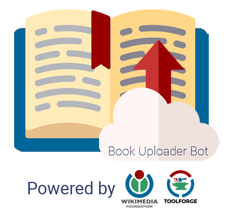

# BUB2    <br>

 <br>
    <br>
A book uploader bot that transfers documents from public libraries such as Google Books, Punjab Digital Library and Trove Digital Library to [Internet Archive](https://archive.org). Built for Wikimedia Tool Labs. Check out [BUB2 on Toolforge](https://bub2.toolforge.org)!

# Table of Contents

- [Getting Started](#getting-started)
  -  [Prerequisites](#prerequisites)
  - [Local setup](#local-setup)
    - [Clone the repo](#clone-the-repo)
    - [Set environment variables](#set-environment-variables)
  - [Run Redis server](#run-redis-server)
    - [Start the server](#start-the-server)
- [Example](#example)
- [Contributing](#contributing)
- [Request to Contribute](#request-to-contribute)
- [Keep Supporting](#keep-supporting)
- [License](#license)

<a id="gettingStarted"></a>
## Getting Started

These instructions will get you a copy of the project up and running on your local machine for development and testing purposes. See deployment for notes on how to deploy the project on a live system.

<a id="prerequisites"></a>
### Prerequisites

- [Node.JS](https://nodejs.org/en/download/) ( check for installation with `npm -v` and `node -v` on terminal )
- [Redis](https://redis.io/)

<a id="localSetup"></a>
### Local setup

<a id="cloneTheRepo"></a>
#### Clone the repo

- Clone the repository `git clone https://github.com/coderwassananmol/BUB2`
- Navigate to the project directory on the terminal: `cd BUB2`.
- For developers, checkout to develop branch: `git checkout develop`
- Run `npm install`

<a id="setEnvironmentVariables"></a>
#### Set environment variables

Rename `.env.example` to `.env`. Then, to fill the credentials,

- Make an account on [archive.org](https://archive.org).
- Go to https://archive.org/account/s3.php . Generate the **access** and **secret** keys and fill
  them in the `.env` file in the corresponding fields.
- Go to [Google Developers console](https://console.developers.google.com/getting-started). Make a new project to run the app. In that Google Developers project, search for 'Books API' in the Google API console, then **enable** the API for the project, then generate the **API keys**, and then copy and paste the API key in the `GB_Key` field.
- Enter the `redishost` field. If it's hosted locally, enter **127.0.0.1**, which is the default localhost.
- Enter the `redisport` field with **6379**, which is the default port number for redis.
  
- You need Beta wiki [OAuth 2.0](https://oauth.net/2/) credentials to login with MediaWiki during development. Steps to obtain the OAuth credentials for the `WIKIMEDIA_CLIENT_ID` and `WIKIMEDIA_CLIENT_SECRET` fields :
  - Go to [Beta-wiki](https://meta.wikimedia.beta.wmflabs.org/wiki/Special:OAuthConsumerRegistration) and click **Request a token for a new OAuth 2.0 client**.
  - Enter the details (Application name, details, callback url, and applicable grants). Refer [this](https://meta.wikimedia.beta.wmflabs.org/wiki/Special:OAuthListConsumers/view/e70de440468d7140914e4a57e3660cf2) as a sample.
  - After submitting, note the client application key and client application secret and wait for the proposed consumer to get **approved**.
  - Go to [this file](pages/api/auth/[...nextauth].js). 
  - Add the following code after the clientId and clientSecret :
      ```
      token: "https://meta.wikimedia.beta.wmflabs.org/w/rest.php/oauth2/access_token",
      userinfo: "https://meta.wikimedia.beta.wmflabs.org/w/rest.php/oauth2/resource/profile",
      authorization: {
      url: "https://meta.wikimedia.beta.wmflabs.org/w/rest.php/oauth2/authorize",
      params: { scope: "" },
      }
      ```
- Enter the client application key and client application secret in the `WIKIMEDIA_CLIENT_ID` and `WIKIMEDIA_CLIENT_SECRET` respectively.
- Enter the `NEXTAUTH_URL` with http://localhost:5000.
<a id="runRedisServer"></a>
### Run Redis server

- Refer to [Redis](https://redis.io/download) for download and setup documentation

<a id="startTheServer"></a>
#### Start the server

- Run `npm run dev` for development and `npm run start` for production.
- Open your browser and navigate to http://localhost:5000

<a id="contributing"></a>
## Contributing

Please read [CONTRIBUTING.md](https://github.com/coderwassananmol/BUB2/blob/develop/CONTRIBUTING.md) for information on how to contribute to BUB2.

<a id="requestToContribute"></a>
## Request to Contribute
1. Fork the repository.
2. Clone the repository to your local system by using the command : `git clone "https://github.com/<YOUR_USERNAME>/BUB2"`. 
3. The issues are maintained on [Phabricator](https://phabricator.wikimedia.org/maniphest/?project=PHID-PROJ-wnkiea2sihld2xlpq527&statuses=open()&group=none&order=newest#R).
4. Assign an issue to yourself from Phabricator.
5. Create a new branch and start working on the issue locally.
6. Create a PULL REQUEST to merge your branch with the main branch and mention the Phab task in the description.
7. The issue will be considered closed and resolved once the PR is accepted. 
Please read [CONTRIBUTING.md](https://github.com/coderwassananmol/BUB2/blob/develop/CONTRIBUTING.md) for information on how to contribute to BUB2.

<a id="keepSupporting"></a>
## Contribute
We actively welcome pull requests. Learn how to [contribute.](https://github.com/coderwassananmol/BUB2/blob/master/CONTRIBUTING.md)
## Keep Supporting

There was no Node.js wrapper available for Internet Archive, so I decided to write the Node implementation to upload books to Internet Archive. If you like this repository, show your support by starring the project. Cheers!

<a id="license"></a>
## License
[](https://github.com/coderwassananmol/BUB2/blob/develop/LICENSE.md)
 
 Please read [license](https://github.com/coderwassananmol/BUB2/blob/develop/LICENSE.md) for more information.
