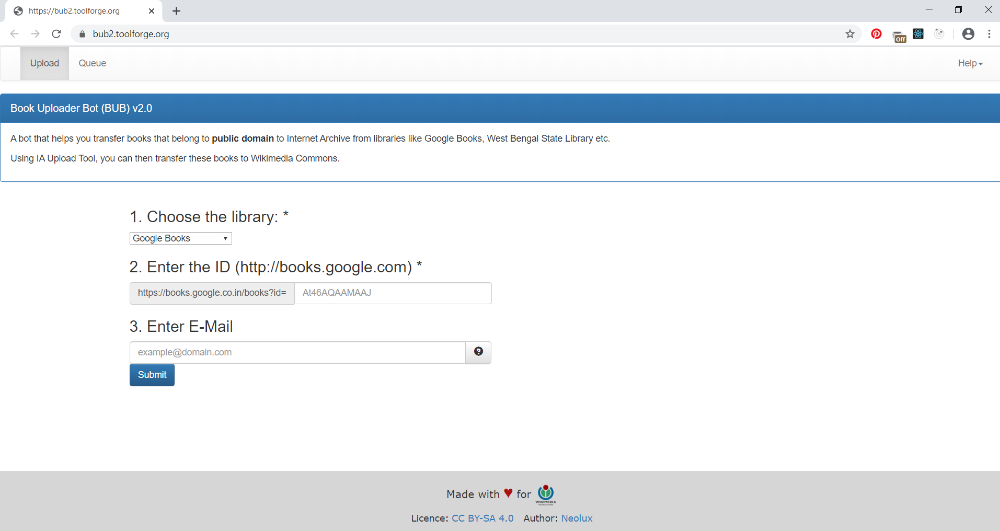

# BUB2    <br>

 <br>
    <br>
A book uploader bot that transfers documents from public libraries such as Google Books, and Punjab Digital Library etc to Internet Archive. Built for Wikimedia Tool Labs. Check out [BUB2 on Toolforge](https://bub2.toolforge.org)!

## Getting Started

These instructions will get you a copy of the project up and running on your local machine for development and testing purposes. See deployment for notes on how to deploy the project on a live system.

### Prerequisites

- [Node.JS](https://nodejs.org/en/download/) ( check for installation with `npm -v` and `node -v` on terminal )
- [Docker toolbox](https://docs.docker.com/toolbox/toolbox_install_windows/) ( Optional )
- [Redis](https://redis.io/)

### Local setup

#### Clone the repo

- Clone the repository `git clone https://github.com/coderwassananmol/BUB2`
- Navigate to the project directory on the terminal: `cd BUB2`.
- For developers, checkout to develop branch: `git checkout develop`
- Run `npm install`

#### Set environment variables

Rename `.env.example` to `.env`. Then, to fill the credentials,

- Make an account on [archive.org](https://archive.org) and note down the sign-in credentials. Using these details, fill 'email' and 'password' fields in the `.env` file.
- Go to https://archive.org/account/s3.php . Generate the **access** and **secret** keys and fill
  them in the `.env` file in the corresponding fields.
- Go to [Google Developers console](https://console.developers.google.com/getting-started). Make a new project to run the app. In that Google Developers project, search for 'Books API' in the Google API console, then **enable** the API for the project, then generate the **API keys**, and then copy and paste the API key in the `GB_Key` field.
- Fill the `redishost` field with **docker** if you are using docker, otherwise **127.0.0.1**
- Fill the `redisport` field with **6379**, which is the default port number for redis.
- Fill `service` field with your mail service provider (Ex. gmail, outlook)
  Note: In order to send email through gmail, you may need to allow less secure app access. To turn it on, go to https://myaccount.google.com/lesssecureapps?pli=1

### Run Redis server

- Refer to [Redis](https://redis.io/download) for download and setup documentation ,or

#### Running Redis using Docker

```
docker run --name redis -p 6379:6379 redis
docker start redis
```

#### Running Redis using Docker Compose

```
docker-compose up -d
docker-compose start
```

#### Start the server

- Run `npm run dev` for development and `npm run start` for production.
- Open your browser and navigate to http://localhost:5000

### Example
  This is the simple Example how BUB2(Book Uploader Bot) works.
1. Open the Website [here](https://bub2.toolforge.org/)
 

2. Choose the Library option.
 <video src="public/assets/choose.mp4" height="500px">

3. Then enter the ID or URI.
 <video src="public/assets/id.m4" height="500px">

4. In this We use the example for the [Panjab digital Library](http://www.panjabdigilib.org/webuser/searches/mainpage.jsp)

`Link:- http://www.panjabdigilib.org/webuser/searches/displayPage.jsp?ID=11567&page=1&CategoryID=1&Searched=#.XnMWhz0r4jA.gmail`

<video src="public/assets/uri.mp4" height="500px">

5. Then Enter your Email address which will be used to notify that your upload has been completed and click the submit button.

## Contributing

Please read [CONTRIBUTING.md](https://github.com/coderwassananmol/BUB2/blob/develop/CONTRIBUTING.md) for information on how to contribute to BUB2.

## Request to Contribute
1. Fork the repository.
2. Clone the repository to your local system by using the command : `git clone "https://github.com/<YOUR_USERNAME>/BUB2"`. 
3. To work on an issue, go through the issues section in the main repository.
4. Select an issue you would like to work on and comment expressing your interest.
5. Start working on the issue once it is assigned to you.
6. Create a new branch and start working on the issue locally.
7. Create a PULL REQUEST to merge your branch to the main branch.
8. The issue will be considered closed and resolved once the PR is accepted. 
Please read [CONTRIBUTING.md](https://github.com/coderwassananmol/BUB2/blob/develop/CONTRIBUTING.md) for information on how to contribute to BUB2.


## Keep Supporting

There was no Node.js wrapper available for Internet Archive, so I decided to write the Node implementation to upload books to Internet Archive. If you like this repository, show your support by starring the project. Cheers!

## Licence
[](https://github.com/coderwassananmol/BUB2/blob/develop/LICENSE.md)
 
 Please read [licence](https://github.com/coderwassananmol/BUB2/blob/develop/LICENSE.md) for more information.
